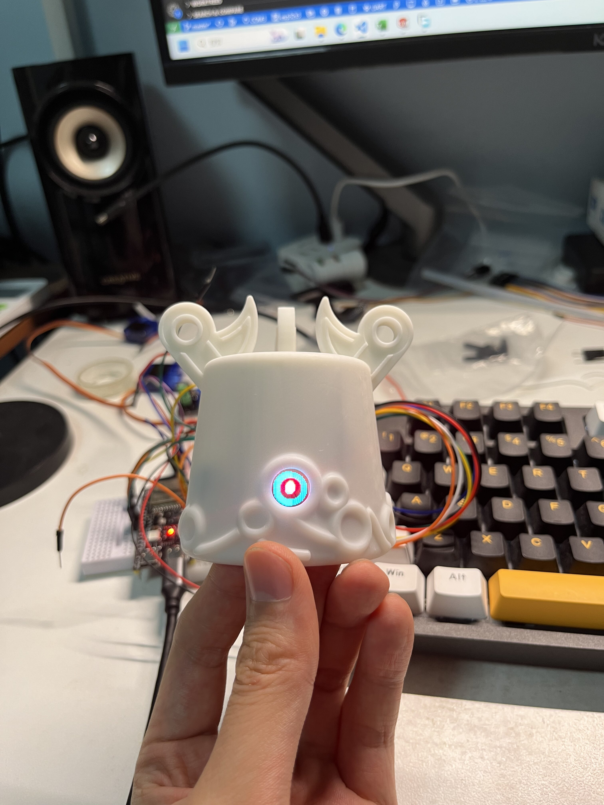
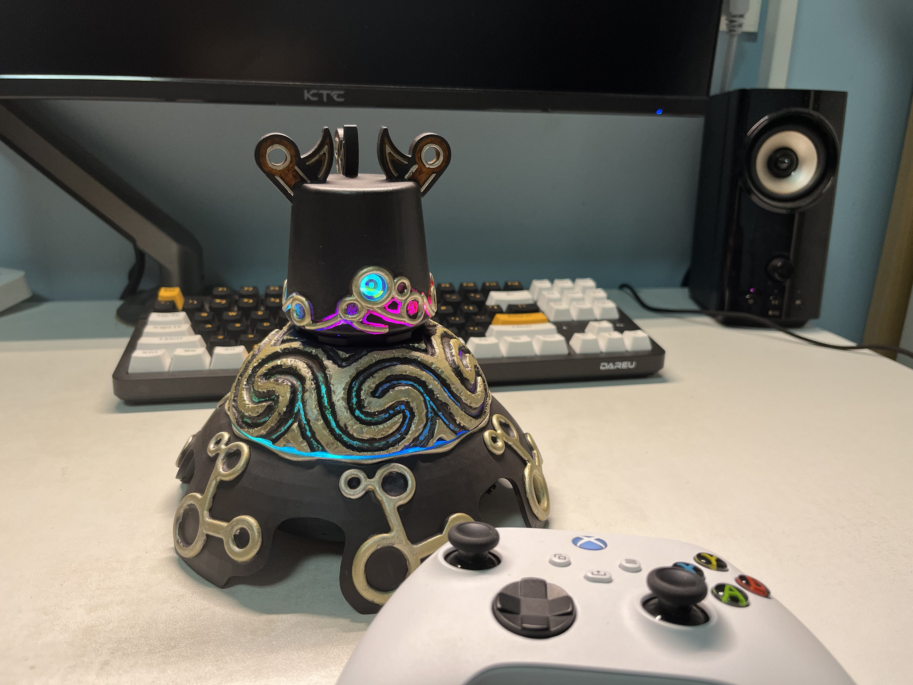
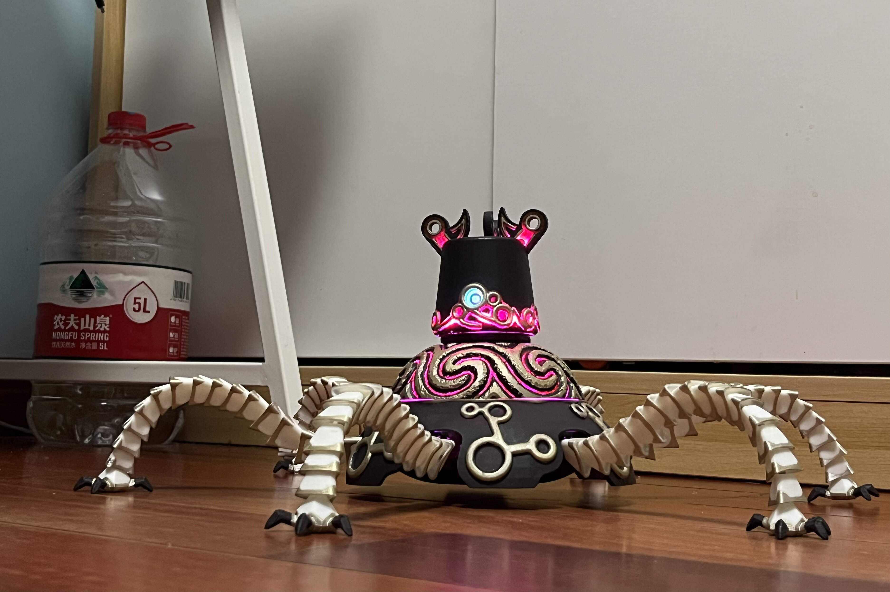

# 塞尔达传说旷野之息守护者模型项目

## 项目介绍

本项目致力于复刻《塞尔达传说：旷野之息》中的守护者模型。项目包含了守护者的SolidWorks模型、硬件PCB设计以及基于ESP32-S3的软件部分。

## 项目展示

- **图片**
  - 
  - 
  - 
- **视频**
  - B站链接：https://www.bilibili.com/video/BV1vh4y1A7ve/?share_source=copy_web&vd_source=ff8870a89e973cca407edad87d57f622
  - 油管链接：https://youtu.be/EcbjQE96Pl4?si=KqaRee9nlnVQqD4i

## 项目内容

- **SolidWorks模型**
  - 守护者3D模型设计
  - 可打印的STL文件
- **硬件PCB设计**
  - 电路图和PCB布局
  - 元件清单
  - 制造文件
- **软件部分（ESP32-S3）**
  - 嵌入式C代码
  - 功能实现说明

## 使用说明

1. **获取SolidWorks模型**
   - 下载STL文件
   - 使用3D打印机打印模型
2. **硬件PCB制作**
   - 根据提供的文件制作PCB
   - 元件焊接与测试
3. **软件编程与调试**
   - 下载vs code或其他兼容的开发环境
   - 编译并上传固件到ESP32-S3模块
   - 调试与功能测试

## 开发环境

- **SolidWorks** (用于编辑和查看3D模型)
- **VS code** (用于编写和上传ESP32-S3代码)
- **推荐的PCB设计软件** (立创eda)

## 参与贡献

欢迎对《塞尔达传说：旷野之息》守护者模型感兴趣的开发者参与项目！请通过GitHub的Pull Request功能提交您的贡献。
也可以加入我的qq交流群：971609269

## 许可证

本项目采用[MIT许可证](https://opensource.org/licenses/MIT)。

## 联系方式

如需报告问题或提出建议，请通过GitHub的Issue跟踪系统告知。
